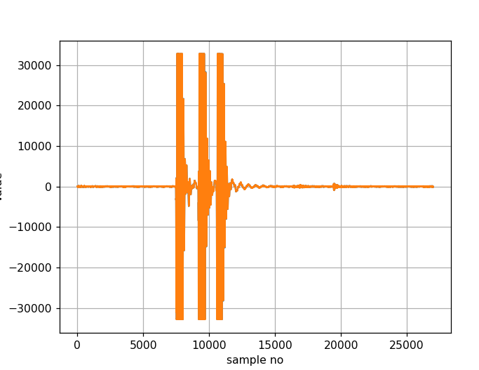
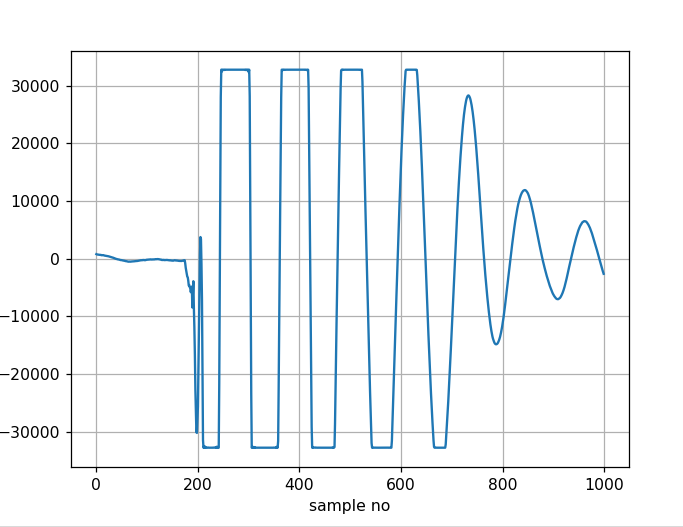
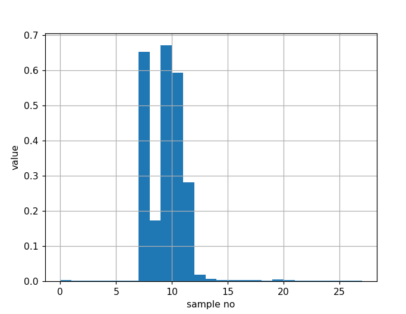

# Sound Activated Audio Recorder

Auto Record is a Python script that records audio in WAV files.
Instead of recording continuously, Auto Record creates multiple
recordings, starting when noise is detected and stopping when there
is a period of silence.

The WAV files can be accessed via a simple web service implemented
in web_server.py

## Scripts

This project has the following scripts:

- auto_record.py: The noise triggered audio recorder
- web_server.py: Web server to access audio recordings
- wav2csv.py: Convert WAVE files to CSV and plot audio data
- play.py: Sample script to play audio files
- record.py: Simple example script to record WAVE files


## Dependencies

The audio recorder requires pyaudio which requires the portaudio package.
The web server requires fastapi

First, ensure you have pip and venv:
```
sudo apt install pip
sudo apt install python3-venv
```

Install the portaudio19 dev package:
```
sudo apt install portaudio19-dev
```

Create an isolated venv and install the required package

```
python3 -m venv venv 
source ./venv/bin/activate
pip install -r requirements.txt
```

## Running the Audio Recorder

The recording script can be run directory from the command line:

python auto_record.py [ debug ] [ calibrate | disabled ]
- debug: print debug information
- calibrate: run an interactive audio calibration and exit
- disabled: start the recorder with recording disabled

```
source ./venv/bin/activate
python auto_record.py
```

## Running the Web Server

The web server provides access to the recordings and the ability to enable
and disable recording.


```
source ./venv/bin/activate
python web_server.py
```

Connect to localhost:3000 to see the list of recordings.

## Calibration

Calibrate the trigger threshold by running an interactive calibraiton process.
The process needs 2 seconds of quiet to establish a baseline, then a 1/2 second
noise at the level that should trigger a recording.

```
source ./venv/bin/activate
python auto_record.py calibrate
```

## State Files

The auto_record.py script creates a data directory under the working directory.
In this directory, it creates:
- .wav files - recordings
- .json files - information for each recording in json format
- record - if present, recording is enabled
- calibrated - created by the calibraiton process.


## Web Service

Start the web server providing access to the audio files.
Note that there is no access control for this web server.

```
source ./venv/bin/activate
python web_server.py
```

## Automatic Startup

In addition to being run directly from the command line, the 
scripts can be run with systemd for automatic start on boot up.
There are issues with the default sound input device being different
when run from systemd. The auto_record_log.txt file can be helpful
in troubleshooting issues.

Note that on the RaspberryPi, the sound card needs to be configured
in /etc/asound.conf.  Run cat /proc/asound/cards to see the existing
sound options.

For more info, see: 
[[SOLVED] Help: ffmpeg and alsa - work as script not as systemd service problem](https://forums.raspberrypi.com/viewtopic.php?t=278665)

### Configure Autostart

Change the User= and WorkingDirectory= lines
in the auto_record.service and auto_record_server.service files.
Install the files:

```
sudo cp auto_record.service /lib/systemd/system
sudo cp auto_record_server.service /lib/systemd/system
sudo systemctl daemon-reload
sudo systemctl enable auto_record
sudo systemctl enable auto_record_server
```

Start the services:

```
sudo systemctl start auto_record
sudo systemctl start auto_record_server
sudo systemctl status auto_record
sudo systemctl status auto_record_server
```


### Shutdown and Removing Files

To remove the installed systemd configuration:

```
sudo systemctl stop auto_record
sudo systemctl stop auto_record_server
sudo systemctl disable auto_record
sudo systemctl disable auto_record_server
sudo rm /lib/systemd/system/auto_record.service 
sudo rm /lib/systemd/system/auto_record_server.service 
```

## Graphing Sound Files

It is facinating to look at sound files graphically to understand the nature
of the signals. The wav2csv.py module reads a wav file and writes a CSV file
containing the audio samples. It has some additional routines to create
simple plots of the audio data.

### Required Packages

In order to analyze and plot sound file data, you need two additional modules not included
in the requriements.txt:

```
pip install numpy
pip install matplotlib
```
### View Audio 

To view the data as well as generate a CSV file, run the script with the -i argument to python:
```
python -i wav2csv.py <WAVE file>
```

After the CSV file is written, the sound data is in the numpy ndarray array:

```
python -i wav2csv.py data/2025-01-20_16:14:25.wav
Write file: data/2025-01-20_16:14:25.wav.csv
Done
>>> array
array([[ -15,  -17],
       [  -6,   -8],
       [  18,   17],
       ...,
       [-122, -122],
       [-151, -150],
       [-136, -136]], shape=(27000, 2))
```

### Plot the Audio Data

Plot all audio data

```
plot_array(array)
```



Plot only the first channel of the array:

```
plot_array(array[:,0])
```

Noom in, plotting samples 9000 to 10000

```
plot_array(array[9000:10000,0])
```



### Plot Volume

Plot the volume of each block of audio:

```
python
>>> import wav2csv as w
>>> blocks = w.read_data_blocks("data/2025-01-20_16:14:25.wav")
>>> volume = w.get_volume_array(blocks)
>>> w.plot_stairs(volume)
```



